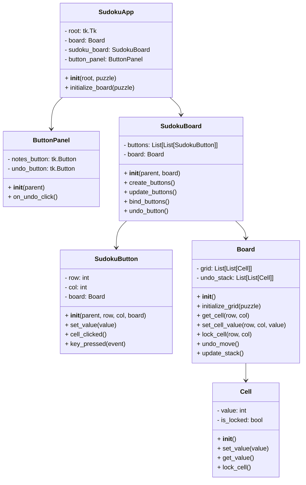
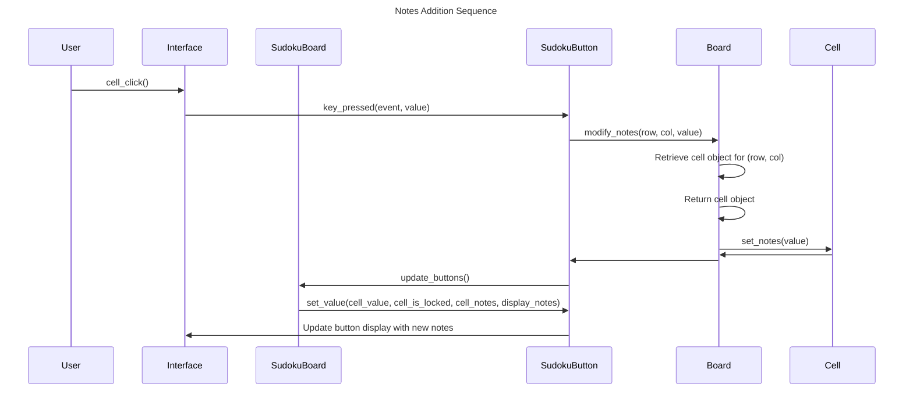

```mermaid
classDiagram
    class SudokuApp {
        - root: tk.Tk
        - board: Board
        - sudoku_board: SudokuBoard
        - button_panel: ButtonPanel
        + __init__(root, puzzle)
        + initialize_board(puzzle)
    }

    class ButtonPanel {
        - notes_button: tk.Button
        - undo_button: tk.Button
        + __init__(parent)
        + on_undo_click()
    }

    class SudokuBoard {
        - buttons: List[List[SudokuButton]]
        - board: Board
        + __init__(parent, board)
        + create_buttons()
        + update_buttons()
        + bind_buttons()
        + undo_button()
    }

    class SudokuButton {
        - row: int
        - col: int
        - board: Board
        + __init__(parent, row, col, board)
        + set_value(value)
        + cell_clicked()
        + key_pressed(event)
    }

    class Board {
        - grid: List[List[Cell]]
        - undo_stack: List[List[Cell]]
        + __init__()
        + initialize_grid(puzzle)
        + get_cell(row, col)
        + set_cell_value(row, col, value)
        + lock_cell(row, col)
        + undo_move()
        + update_stack()
    }

    class Cell {
        - value: int
        - is_locked: bool
        + __init__()
        + set_value(value)
        + get_value()
        + lock_cell()
    }

    SudokuApp --> ButtonPanel
    SudokuApp --> SudokuBoard
    SudokuBoard --> SudokuButton
    SudokuBoard --> Board
    Board --> Cell

```

```mermaid
sequenceDiagram
    title: Notes Addition Sequence
    participant User
    participant Interface
    participant SudokuBoard
    participant SudokuButton
    participant Board
    participant Cell

    User->>Interface: cell_click()
    Interface->>SudokuButton: key_pressed(event, value)
    SudokuButton->>Board: modify_notes(row, col, value)
    Board->>Board: Retrieve cell object for (row, col)
    Board->>Board: Return cell object
    Board->>Cell: set_notes(value)
    Cell->>Board: 
    Board->>SudokuButton: 
    SudokuButton->>SudokuBoard: update_buttons()
    SudokuBoard->>SudokuButton: set_value(cell_value, cell_is_locked, cell_notes, display_notes)
    SudokuButton->>Interface: Update button display with new notes

```