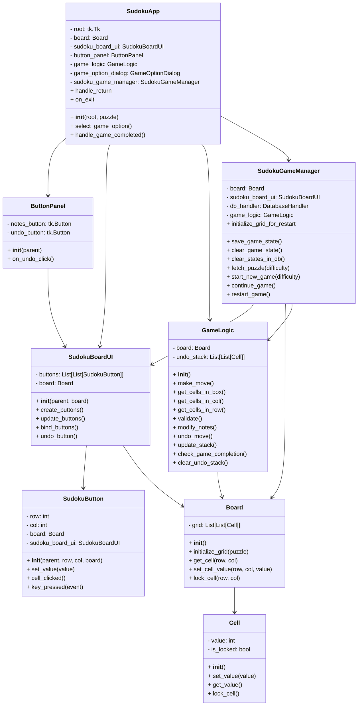

# Arkkitehtuurikuvaus

## Rakenne

Ohjelman rakenne ja luokkien riippuvuudet luokkakaaviona:



Ohjelman rakenne muodostuu UI-luokista, joiden toiminnallisutta hoitaa SudokuGameManager-luokka ja GameLogic-luokka. SudokuGameManager-luokka vastaa toiminnallisuuksista pelien välissä, ja GameLogic-luokka pelin aikana. Board- ja Cell-luokat esittävät peliruudukkoa ja sen ruutuja. 


## Päätoiminnallisuudet

### Pelin aloitus sekvenssikaaviona:

```mermaid
sequenceDiagram
    title: Game Start sequence
    participant User
    participant Interface
    participant GameStartDialog
    participant SudokuGameManager
    participant DatabaseHandler
    participant Board
    participant SudokuBoardUI


    User->>Interface: difficulty_level
    Interface->>GameStartDialog: NewGame
    GameStartDialog->>SudokuGameManager: start_new_game(difficulty_level)
    SudokuGameManager->>SudokuGameManager: fetch_puzzle(difficulty_level)
    SudokuGameManager->>DatabaseHandler: get_puzzle_by_difficulty(difficulty_level)
    DatabaseHandler->>SudokuGameManager: return puzzle
    SudokuGameManager->>Board: initialize_grid(puzzle)
    SudokuGameManager->>SudokuBoardUI: update_buttons()
    
``````

Pelaaja valitsee vaikeustason, ja SudokuGameManager-luokka hakee vastaavaa vaikeustasoa olevan pelin tietokannasta, asettaa pelin ruudukkoon ja käynnistää käyttöliittymän.

### Muistiinpanojen lisääminen:

```mermaid
sequenceDiagram
    title: Notes Addition Sequence
    participant User
    participant Interface
    participant SudokuBoard
    participant SudokuButton
    participant GameLogic
    participant Board
    participant Cell

    User->>Interface: cell_click()
    Interface->>SudokuButton: key_pressed(event, value)
    SudokuButton->>GameLogic: modify_notes(row, col, value)
    GameLogic->>Board: set_cell_notes(row, col, value)
    Board->>Board: Retrieve cell object for (row, col)
    Board->>Board: Return cell object
    Board->>Cell: set_notes(value)
    Cell->>Board: 
    Board->>GameLogic: 
    GameLogic->>SudokuButton: 
    SudokuButton->>SudokuBoard: update_buttons()
    SudokuBoard->>SudokuButton: set_value(cell_value, cell_is_locked, cell_notes, display_notes)
    SudokuButton->>Interface: Update button display with new notes

```

Pelaaja syöttää valitun arvon ruudukkoon, ja ruutua esittävä SudokuButton-luokka kutsuu GameLogic-luokkaa, joka kutsuu Board- ja Cell-luokkia, mitkä asettaa uuden arvon kyseisen ruudun muistiinpanoihin.

### Muut toiminnallisuudet

Arvon (ei muistiinpano) syöttäminen tapahtuu lähes samalla tavalla, mutta lisäksi siihen liittyy arvon validointi (onko samaa numeroa rivissä/laatikossa/sarakkeessa). Lisäksi, jos validointi menee läpi, GameLogic-luokka tarkistaa, onko kyseessä viimeinen (voitto) siirto.

Pelin uudelleenkäynnistys ja jatkaminen tapahtuu hyvin samalla tavalla kuin uuden pelin aloitus, mutta siinä välissä ruudukko alustetaan uudestaan.

## Tietojen tallennus

Sovellus käyttää sqlite tietokantaa, johon tallennetaan pelattavat pelit, sekä käyttäjän viimeisin kesken oleva peli. Pelattavat pelit tallennetaan merkkijonoina. Viimeisin peli tallennetaan json-muodossa, jotta ruutujen kaikki tiedot säilyvät.

## Ohjelman rakenteen heikkoudet

Lopullinen rakenne voisi olla selkeämpi ja helpommin muokattavissa. Riippuvuudet olisi voitu suunnitella alusta alkaen paremmin.