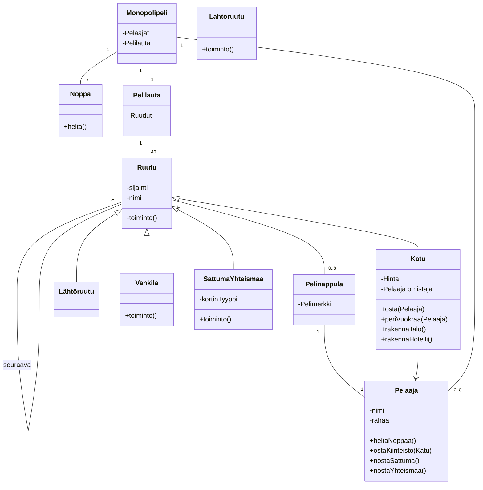

```mermaid
 classDiagram
    Monopolipeli "1" -- "2" Noppa
    Monopolipeli "1" -- "1" Pelilauta
    Ruutu "1" -- "1" Ruutu : seuraava
    Ruutu "1" -- "0..8" Pelinappula
    Pelinappula "1" -- "1" Pelaaja
    Pelaaja "2..8" -- "1" Monopolipeli
    Pelilauta "1" -- "40" Ruutu
    Ruutu <|-- Katu
    Ruutu <|-- Lähtöruutu
    Ruutu <|-- Vankila
    Ruutu <|-- SattumaYhteismaa
    Katu  --> Pelaaja
    class Noppa{
        +heita()
    }
    class Monopolipeli{
        -Pelaajat
        -Pelilauta
    }
    class Pelilauta{
        -Ruudut
    }
    class Ruutu{
        -sijainti
        -nimi
        -toiminto()
    }
    class Katu{
        -Hinta
        -Pelaaja omistaja
        +osta(Pelaaja)
        +periVuokraa(Pelaaja)
        +rakennaTalo()
        +rakennaHotelli()
    }
    class Lahtoruutu{
        +toiminto()
    }
    class Vankila{
        +toiminto()
    }
    class SattumaYhteismaa{
        -kortinTyyppi
        +toiminto()
    }
    class Pelaaja{
        -nimi
        -rahaa
        +heitaNoppaa()
        +ostaKiinteisto(Katu)
        +nostaSattuma()
        +nostaYhteismaa()
      }
    class Pelinappula{
        -Pelimerkki
    }
    
```

