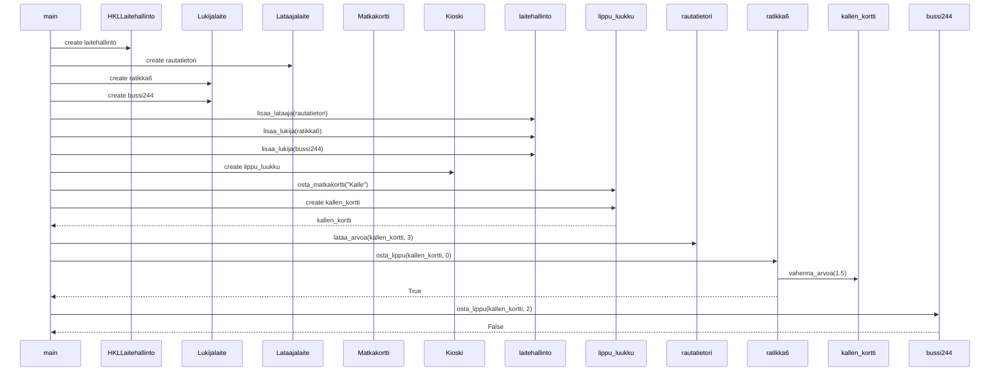

```mermaid
sequenceDiagram
    participant main
    participant HKLLaitehallinto
    participant Lukijalaite
    participant Lataajalaite
    participant Matkakortti
    participant Kioski

    main ->> HKLLaitehallinto: create laitehallinto
    main ->> Lataajalaite: create rautatietori
    main ->> Lukijalaite: create ratikka6
    main ->> Lukijalaite: create bussi244

    main ->> laitehallinto: lisaa_lataaja(rautatietori)
    main ->> laitehallinto: lisaa_lukija(ratikka6)
    main ->> laitehallinto: lisaa_lukija(bussi244)

    main ->> Kioski: create lippu_luukku
    main ->> lippu_luukku: osta_matkakortti("Kalle")
    main ->> lippu_luukku: create kallen_kortti
    lippu_luukku -->> main: kallen_kortti

    main ->> rautatietori: lataa_arvoa(kallen_kortti, 3)
    main ->> ratikka6: osta_lippu(kallen_kortti, 0)
    ratikka6 ->> kallen_kortti: vahenna_arvoa(1.5)
    ratikka6 -->> main: True
    main ->> bussi244: osta_lippu(kallen_kortti, 2)
    bussi244 -->> main: False


```
